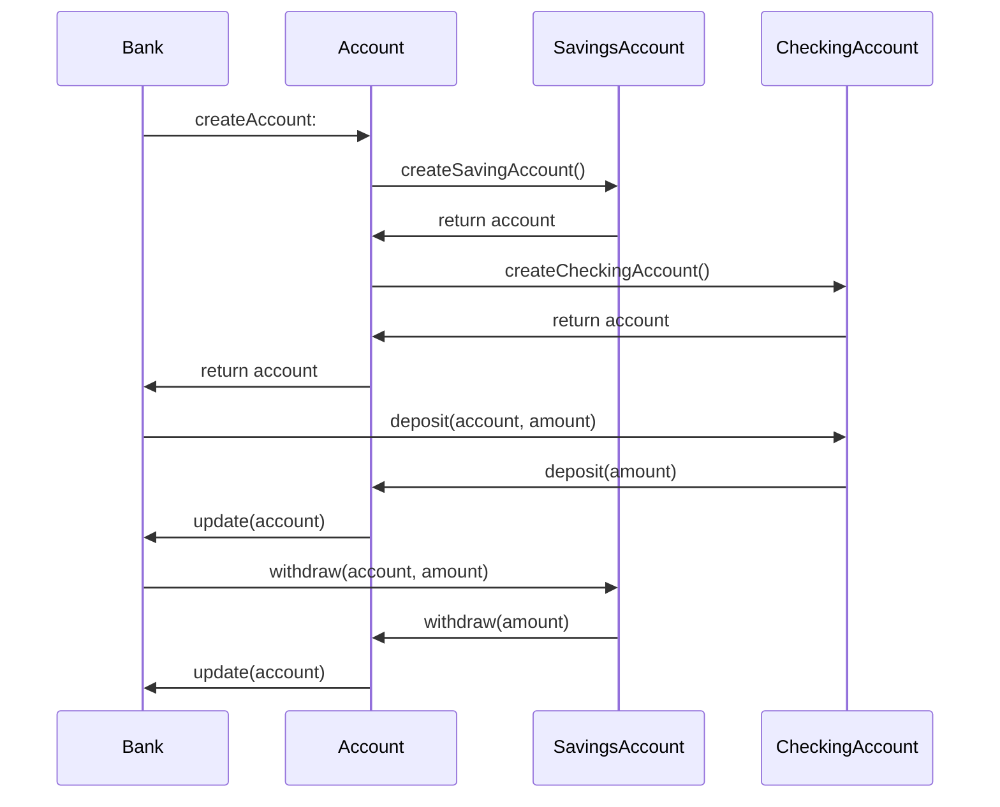

# UML Sequence Diagram

```mermaid
sequenceDiagram
    Bank->> Account: createAccount:
    Account ->>SavingsAccount: createSavingAccount()
    SavingsAccount->>Account: return account
    Account->>CheckingAccount: createCheckingAccount()
    CheckingAccount->>Account: return account
    Account->>Bank: return account
    Bank->>CheckingAccount: deposit(account, amount)
    CheckingAccount->>Account: deposit(amount)
    Account->>Bank: update(account)
    Bank->>SavingsAccount: withdraw(account, amount)
    SavingsAccount->>Account: withdraw(amount)
    Account->>Bank: update(account)
```
